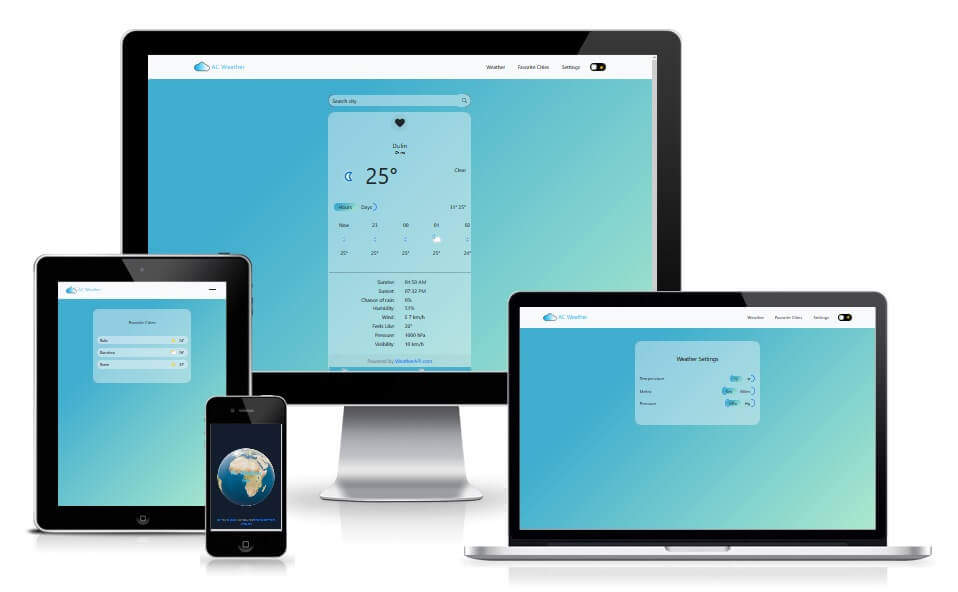
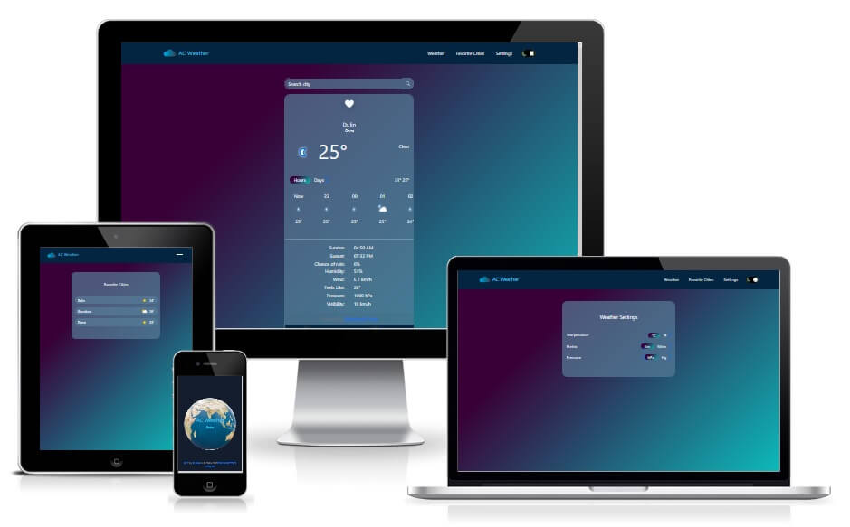
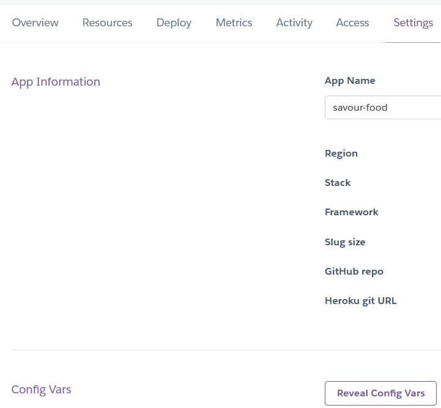
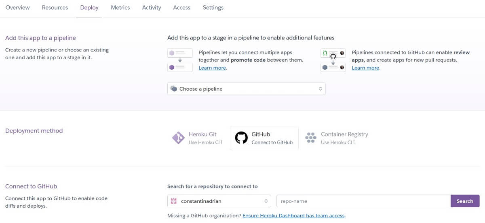
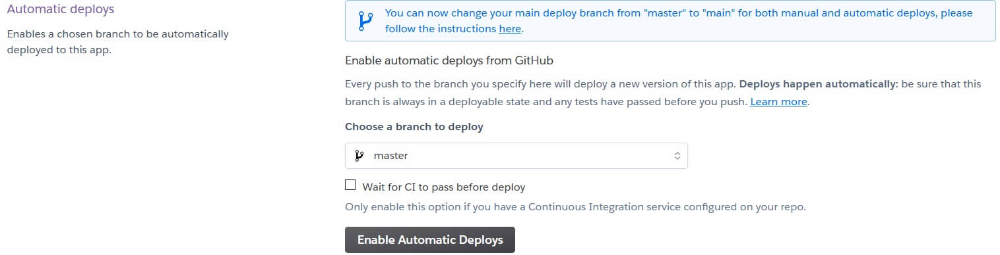
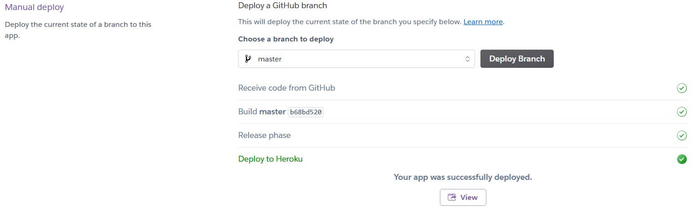
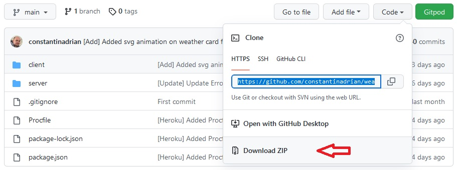

# AC Weather

## Light Mode



## Dark Mode



AC Weather is a full stack weather application made with Node - Express JS and React JS.

[View live project here](https://ac-weather.herokuapp.com)

## Table of Contents

1. [UX](#ux)

    - [Structure](#structure)

2. [Technologies Used](#technologies-used)

4. [Deployment](#deployment)

    - [Heroku](#heroku)

    - [Local Clone](#local-clone)

5. [Credit](#credit)

6. [Disclaimer](#disclaimer)

[Back to Top](#table-of-contents)

-----

- ### UX:
 
  - #### Structure

    - ##### Features: 

        Responsive on all screen devices.

      - ##### Existing Features:
    
        1. Home Page 

            - Welcome user with a 3D animation

        2. Weather Page 

            - Where the user can search any city and have information display

        3. Favorite cities Page

            - Where user can see all his favorite cities. For details weather info can click on any city and will redirect to weather page to see more info 

        4. Settings Page

            - Where user can change the settings on display weather info (E.g. °C to °F)
        
        5. Light and Dark Mode
        
      - ##### Future Features to Implement:

        - Allow the app to set the weather from your current location

[Back to Top](#table-of-contents)

-----

- ### Technologies Used

  - #### Languages:

    - [HTML5](https://en.wikipedia.org/wiki/HTML5) - used to structure website and its content.

    - [CSS3](https://en.wikipedia.org/wiki/CSS) - to format the contents of each webpage.

    - [JS](https://en.wikipedia.org/wiki/JavaScript) - for DOM manipulation.

  - #### Frameworks & Libraries:

    - [Express](https://expressjs.com/) – Backend web application framework for Node.js

    - [Axios](https://axios-http.com/docs/intro) - a Javascript library used to make HTTP requests from node.js

    - [React Hook Form](https://react-hook-form.com/) - a library that helps you validate forms in React.

    - [Redux](https://redux.js.org/) - a JavaScript library for managing and centralizing application state

    - [React-Redux](https://react-redux.js.org/) - is the official Redux UI binding library use to bind Reactjs and Redux

    - [React Router Dom](https://reactrouter.com/) - to implement dynamic routing in a web app (React Router
v6)

    - [React-Bootstrap](https://react-bootstrap.github.io/) - a component-based library that provides native Bootstrap components as pure React components.

    - [Dayjs](https://day.js.org/) - a minimalist JavaScript date library for parsing, validating, manipulating, and formatting dates.

    - [Framer Motion](https://www.framer.com/motion/) - an animation library

    - [Three.js](https://threejs.org/) - JavaScript 3D library

    - [Bootstrap](https://getbootstrap.com/) – CSS framework used to help with classes to make the app responsive.

    - [GitHub](https://github.com/) - used to create and host the repository

    - [Git](https://git-scm.com/) - used for the version-control system for tracking changes in any set of files

    - [Heroku](https://www.heroku.com/) - cloud platform for hosting the website

  - #### Additional tools:

    - [VS Code](https://code.visualstudio.com/) - IDE

    - [Create React App](https://create-react-app.dev/) - This project was bootstrapped with Create React App

    - [Weather API](https://www.weatherapi.com/) - for weather data

    - [react-three/fiber](https://docs.pmnd.rs/react-three-fiber/getting-started/introduction) - is a Three.js renderer that helps render 3D models and animations for React

    - [react-three/drei](https://github.com/pmndrs/drei) - A growing collection of useful helpers and fully functional, ready-made abstractions for react-three/fiber.

    - [Autoprefixer CSS](https://autoprefixer.github.io/) - used to add prefix to css code

    - [Tinypng](https://tinypng.com/) - used to compress image file in order to reduce loading time on each page

    - [CSS Validator](https://jigsaw.w3.org/css-validator/) - used to check CSS code for error

    - [Am I Responsive?](https://ui.dev/amiresponsive) - for the main image in Readme to show responsive to different screen size

[Back to Top](#table-of-contents)

-----

- ### Deployment

  - #### Heroku

    - The project was deployed to Heroku using the following steps:

        1. In order to deploy to Heroku you need an [account](https://signup.heroku.com/)

        2. Now you can create a new app from the dashboard ``` New``` Menu

        3. Now you need to set up a name and select a region closest to you

            NOTE: Remember the name has to be unique and generally use a dash and lowercase letters

        4. From the dashboard of your app click on the ``` Settings``` and go to Reveal Config variables
        

        5. Set up the Config Vars

            | Key              | Value               |
            | :----------------| :-----------------: |
            | NODE_ENV         | production          |
            | PORT             | 3001                |
            | WEATHER_API_KEY  | <your_secret_key>   |

        6. Now from the dashboard of your app click on the Deploy and from the Deployment method select ``` Github - Connect to Github```. Next on the search field type the name of the repository you want to deploy.
        

        7. Once it finds your repository click ```Connect```

        8. Next you can click ```Enable Automatic Deploys```
        

        9. Now From Manual Deploy you can click ```Deploy Branch``` and once it's finished you can click ```View```
        

  - #### Local Clone

    ##### In order to run this project locally you should have installed these 2 requirements on your machine plus an account on [Weather API](https://www.weatherapi.com/):

    1. [VS Code](https://code.visualstudio.com/) - IDE or your personal preference

    2. [Node.js](https://nodejs.org/en/) - to run the application on your local machine

        Now you can create an account on [Weather API](https://www.weatherapi.com/)
    
        Optional: you can install [Git](https://git-scm.com/)

    ##### Steps to follow

    1. At the top of the repository click on Code and click on download zip and extract the zip file to your chosen folder or keep the same name
        

        Optional: if you have [Git](https://git-scm.com/) install on your machine you can type
          ```
          git clone https://github.com/constantinadrian/weather-app
          ```
        or to clone the repository into a different name on the folder you can run 
          ```
          git clone https://github.com/constantinadrian/weather-app folder_name
          ```
        more info about cloning with git [here](https://git-scm.com/book/en/v2/Git-Basics-Getting-a-Git-Repository).

    2. Install all dependencies with
        ```
        npm intall
        ```
    
    3. Create a .env file in ```server``` folder and add your weather api key
        ```
        WEATHER_API_KEY="your_secret_key"
        ```

    4. Run the application with
        ```
        npm start
        ```

[Back to Top](#table-of-contents)

-----

- ### Credit

  - #### Code

    - [https://stackoverflow.com/questions/9707021/how-do-i-auto-hide-placeholder-text-upon-focus-using-css-or-jquery](https://stackoverflow.com/questions/9707021/how-do-i-auto-hide-placeholder-text-upon-focus-using-css-or-jquery)

    - [https://www.framer.com/docs/](https://www.framer.com/docs/)

    - [https://github.com/github/fetch/issues/203#issuecomment-408665082](https://github.com/github/fetch/issues/203#issuecomment-408665082)

    - [https://ai.googleblog.com/2006/06/extra-extra-read-all-about-it-nearly.html](https://ai.googleblog.com/2006/06/extra-extra-read-all-about-it-nearly.html)

  - #### Media

    - [Earth](https://sketchfab.com/3d-models/earth-36ac223837984d9a841f39edabeefa10) - 3D Model used on home page

    - [Cloud](https://openclipart.org/detail/193455/cloud) - used as website logo

    - [Sun](https://openclipart.org/detail/170678/weather-icon-sunny) - used on footer

    - [Moon](https://openclipart.org/detail/165434/meteo-notte-sereno) - used on footer and added animation

    - [Clouds](https://openclipart.org/detail/314564/clouds) - used on footer and added animation

    - [Eclipse](https://loading.io/) - used for loading

    - [Pexels](https://www.pexels.com/photo/brown-field-and-blue-sky-46160/) - image for page not found

[Back to Top](#table-of-contents)

-----

- ### Disclaimer

  - This project is for educational purposes only.
